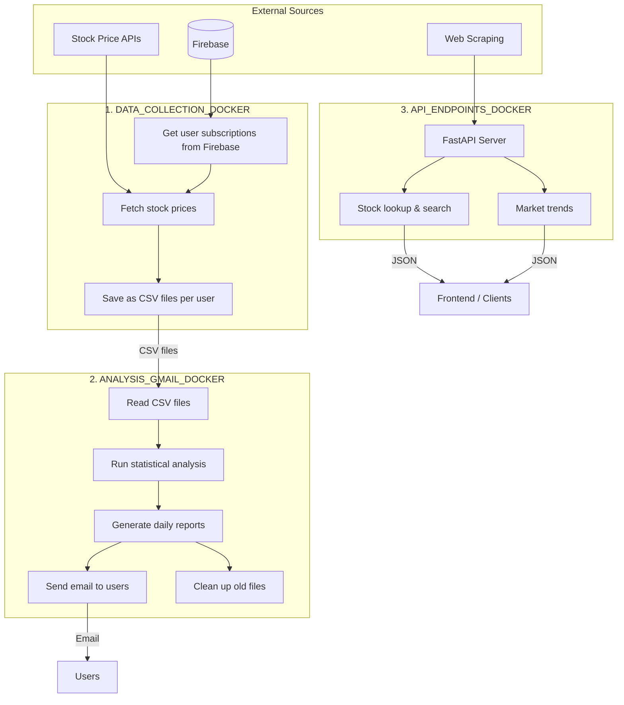
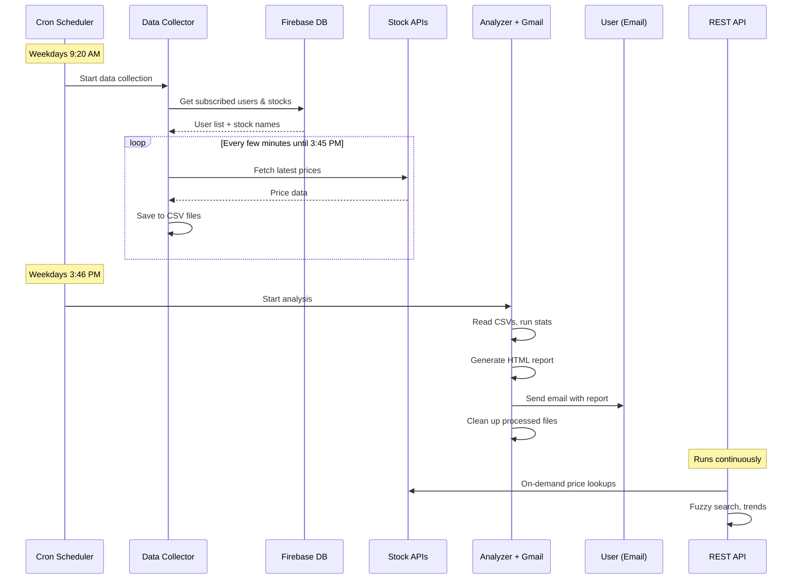
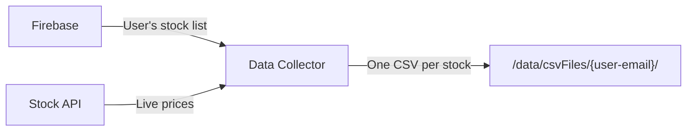
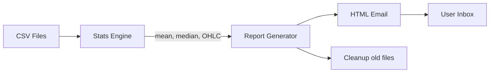
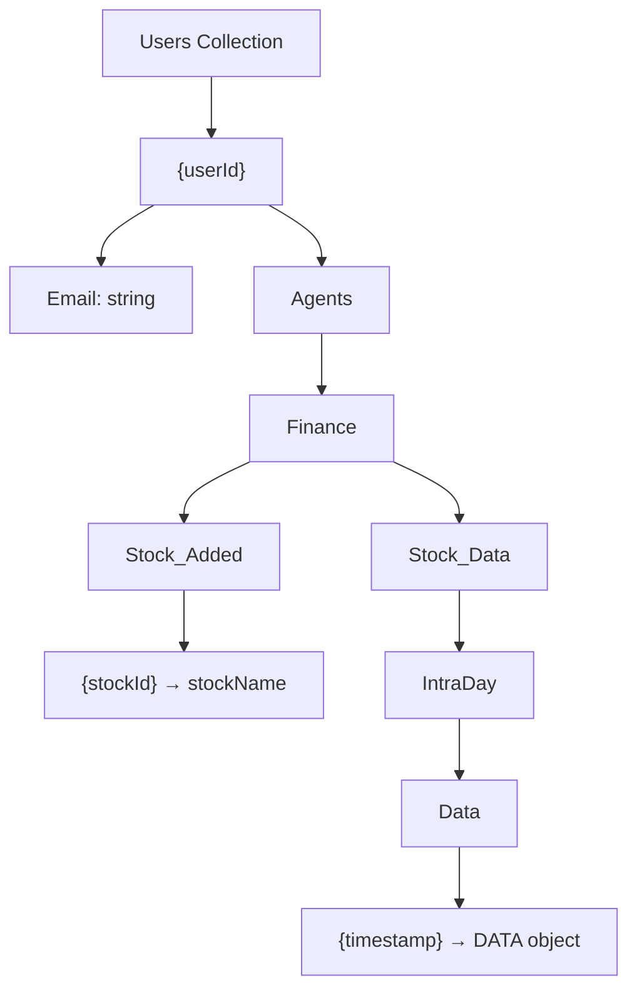

# Stock Automation

A backend system that **automatically collects stock prices, analyzes them, and sends reports to users via email**. It also provides a REST API for looking up stock data. Everything runs in Docker containers and is scheduled with cron jobs.

---

## What Does This Do?

In simple terms, this system:

1. **Collects** stock prices throughout the trading day for each subscribed user
2. **Analyzes** the collected data (averages, highs, lows, trends)
3. **Emails** a daily report to each user with their stock insights
4. **Serves** a REST API so you (or a frontend) can look up stocks in real time

---

## System Architecture



---

## How the Services Work Together



---

## Project Structure

```
Stock_Automation/
├── DATA_COLLECTION_DOCKER/    ← Collects stock prices
│   ├── Data_fetching_from_db/ ← Reads user data from Firebase
│   ├── Stock_price_fetching/  ← Fetches live prices
│   ├── run.py                 ← Entry point
│   └── Dockerfile
│
├── ANALYSIS_GMAIL_DOCKER/     ← Analyzes data & sends emails
│   ├── Stock_analysis_modules/← Stats (mean, median, OHLC)
│   ├── Daily_stock_analysis/  ← Builds daily reports
│   ├── Csv_path_cleaner/      ← Deletes old CSV files
│   ├── runDailyAnalysis.py    ← Entry: run analysis
│   ├── runGmail.py            ← Entry: send emails
│   └── Dockerfile
│
├── API_ENDPOINTS_DOCKER/      ← REST API for stock lookups
│   ├── stock_endpoints/
│   │   ├── options/           ← Stock search & pricing
│   │   └── trends/            ← Gainers, losers, most active
│   ├── main.py                ← FastAPI app
│   └── Dockerfile
│
└── environment/               ← Python virtual environment
```

---

## The Three Services Explained

### 1. Data Collector (`DATA_COLLECTION_DOCKER/`)

**What it does:** Grabs stock prices and saves them.



- Connects to Firebase to find out which users subscribed and what stocks they follow
- Fetches live prices from stock APIs
- Saves the data as CSV files, organized by user email
- Uses fuzzy matching so users can type "Reliance" instead of the exact ticker symbol

### 2. Analyzer + Email (`ANALYSIS_GMAIL_DOCKER/`)

**What it does:** Crunches the numbers and emails users their reports.



- Reads the CSV files saved by the Data Collector
- Calculates stats: average price, high/low, open/close, volatility
- Uses **Gemini AI** to generate plain-English summaries
- Sends a nicely formatted HTML email to each user
- Cleans up old files so storage doesn't grow forever

### 3. REST API (`API_ENDPOINTS_DOCKER/`)

**What it does:** Lets you look up stock info on demand.

| Method | Endpoint | What it returns |
|--------|----------|-----------------|
| GET | `/` | Health check |
| GET | `/stock/{symbol}` | Price & volume for a stock |
| GET | `/search/{symbol}` | Search stocks by name |
| GET | `/gainer` | Today's top gaining stocks |
| GET | `/looser` | Today's top losing stocks |
| GET | `/mostActive` | Most traded stocks today |

**Base URL:** `http://localhost:1555`

---

## Tech Stack

| What | Tool |
|------|------|
| Language | Python 3.11+ |
| API Framework | FastAPI |
| Data Analysis | Pandas, NumPy |
| Database | Firebase Firestore |
| Containers | Docker, Docker Compose |
| Web Scraping | BeautifulSoup4, Requests |
| Stock Name Matching | RapidFuzz |
| Email Sending | yagmail |
| Scheduling | Cron jobs |
| AI Summaries | Google Gemini |

---

## Getting Started

### What You Need

- Python 3.11 or newer
- Docker & Docker Compose
- A Firebase project with a service account JSON key
- API keys (Gemini, etc.)

### Setup Steps

**1. Clone and enter the project:**
```bash
git clone <repository-url>
cd Stock_Automation
```

**2. Install Python packages:**
```bash
pip install -r requirements.txt
```

**3. Set your environment variables:**
```bash
export DOCKER_PATH="/path/to/data/directory"
export GEMINI_API_KEY="your-api-key"
```

**4. Add Firebase credentials:**

Place your Firebase JSON key file in:
- `DATA_COLLECTION_DOCKER/Data_fetching_from_db/`
- `ANALYSIS_GMAIL_DOCKER/Daily_stock_analysis/`

---

## Running the Services

### With Docker Compose (recommended)

```bash
docker-compose up -d fetcher    # Start data collection
docker-compose up -d analyzer   # Start analysis + email
docker-compose up -d api        # Start REST API
```

### Without Docker (manual)

```bash
# Collect stock data
cd DATA_COLLECTION_DOCKER && python run.py

# Run analysis
cd ANALYSIS_GMAIL_DOCKER && python runDailyAnalysis.py

# Send emails
cd ANALYSIS_GMAIL_DOCKER && python runGmail.py

# Start the API server
cd API_ENDPOINTS_DOCKER && uvicorn main:app --host 0.0.0.0 --port 1555
```

---

## Scheduling (Cron Jobs)

The services run automatically on weekdays using cron:

```mermaid
gantt
    title Weekday Schedule (Mon–Fri)
    dateFormat HH:mm
    axisFormat %H:%M

    section Data Collection
    Collect prices   :active, 09:20, 15:45

    section Analysis
    Analyze + Email  :15:46, 16:00
```



```bash
# Start collecting at 9:20 AM
20 9 * * 1-5 /path/to/docker-compose up fetcher

# Stop collecting at 3:45 PM
45 15 * * 1-5 /path/to/docker-compose stop fetcher

# Start analysis at 3:46 PM
46 15 * * 1-5 /path/to/docker-compose up analyzer

# Stop analysis at 4:00 PM
0 16 * * 1-5 /path/to/docker-compose stop analyzer
```

---

## Firebase Database Structure



---

## File Storage Layout

```
/data/
├── csvFiles/
│   └── user@email.com/
│       ├── RELIANCE.csv
│       ├── TCS.csv
│       └── INFY.csv
└── reports/
    └── user@email.com/
        ├── 2025-04-28.html
        └── 2025-04-28.json
```

Each user gets their own folder. Stock data is saved as one CSV per stock, and reports are stored by date.

---

## Troubleshooting

| Problem | What to check |
|---------|---------------|
| **No data in CSVs** | Are Firebase credentials valid? Is the user subscribed? Are API rate limits hit? |
| **Emails not sending** | Check SMTP credentials, firewall rules, and email logs |
| **API not responding** | Verify stock symbol format (e.g., `ASHOKLEY`). Web scraping selectors may have changed |
| **Storage filling up** | Make sure the cleanup job (`cleaningData()`) is running |

---

## Contributing

1. Create a feature branch from `main`
2. Follow PEP 8 style
3. Test locally before submitting
4. Update this README for big changes

---

**Last Updated:** April 2025
**Maintained By:** saifmk.online